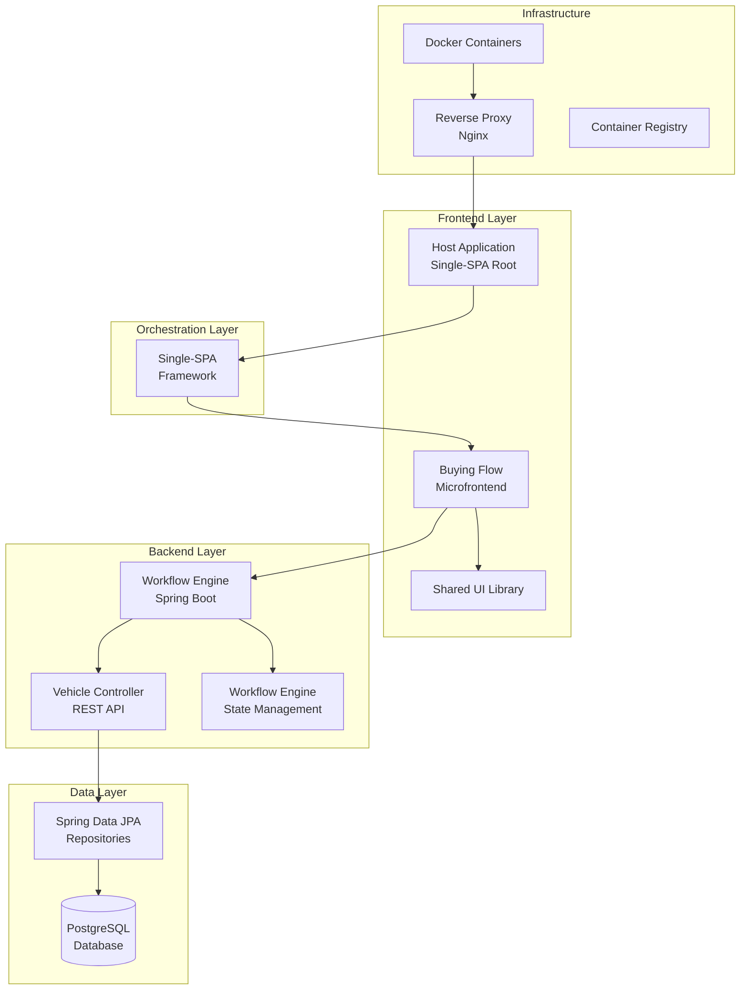

# T-Rex Microfrontend Application - Comprehensive Documentation

## Table of Contents
1. [Functional Overview](#functional-overview)
2. [System Architecture](#system-architecture)
3. [Backend Analysis](#backend-analysis)
4. [Frontend Microfrontends Analysis](#frontend-microfrontends-analysis)
5. [Shared UI Library Analysis](#shared-ui-library-analysis)
6. [Workflow Engine Analysis](#workflow-engine-analysis)
7. [Design Principles](#design-principles)
8. [Technology Stack](#technology-stack)
9. [Deployment and Operations](#deployment-and-operations)

---

## Functional Overview

The T-Rex application is a cost-effective, scalable microfrontend platform designed for vehicle buying/selling workflows. It implements a **backend-driven workflow orchestration** pattern that dynamically guides users through complex business processes.

### Core Features

#### Vehicle Buying Flow
- **Vehicle Knowledge Assessment**: Determines if users know what they want to buy
- **Intelligent Search**: Multi-criteria vehicle search with real-time filtering
- **CarIn Analytics**: AI-powered vehicle recommendations
- **Purchase Confirmation**: Complete purchase request submission with contact details

#### Vehicle Selling Flow
- **Buyer Assessment**: Evaluates if sellers already have buyers
- **Dealer Network Integration**: Connects sellers with dealership network
- **Financing Assistance**: Supports private sales with financing needs
- **Multiple Sale Types**: Private sales, dealer-assisted sales, and network matching

#### Advanced Filtering System
- **Dynamic Filters**: Make, model, year, price, mileage, fuel type, body type, transmission
- **Cascading Selections**: Filters update based on previous selections
- **Range Queries**: Price, year, and mileage range filtering
- **Location-Based**: Province and city filtering

### Business Value
- **Cost Reduction**: Microfrontend architecture reduces development overhead
- **Scalability**: Independent deployment of business features
- **User Experience**: Smooth, guided workflows with intelligent routing
- **Operational Efficiency**: Backend-driven state management ensures data integrity

---

## System Architecture



### Architecture Patterns

#### Backend-Driven Workflow Orchestration
- **State Management**: Backend maintains workflow state and session data
- **Dynamic Routing**: Server determines next steps based on user input and business rules
- **Data Integrity**: Centralized validation and business logic enforcement

#### Microfrontend Architecture
- **Independent Deployment**: Each microfrontend can be deployed separately
- **Shared Libraries**: Common UI components and utilities
- **Single-SPA Integration**: Framework for microfrontend lifecycle management

#### Monorepo Structure
- **pnpm Workspaces**: Efficient dependency management across packages
- **Shared Dependencies**: Reduces duplication and ensures consistency
- **Atomic Changes**: Related changes can be made across packages in single commits

---

## Backend Analysis

### Architecture Components

#### Spring Boot Application Structure
```
backend/workflowservice/
├── src/main/java/com/trex/workflowservice/
│   ├── WorkflowServiceApplication.java      # Main application class
│   ├── config/
│   │   └── CorsConfig.java                   # CORS configuration
│   ├── controller/
│   │   ├── VehicleController.java           # Vehicle CRUD operations
│   │   └── WorkflowController.java          # Workflow orchestration
│   ├── dto/                                 # Data transfer objects
│   ├── model/                               # JPA entities and converters
│   ├── repository/                          # Data access layer
│   ├── service/                             # Business logic layer
│   └── workflow/                            # Workflow definitions
└── src/main/resources/
    └── application.yml                      # Configuration
```

#### Core Components

### Vehicle Management System

#### VehicleController
- **REST Endpoints**: Comprehensive vehicle search and filtering API
- **Dynamic Filtering**: Cascading filter logic based on user selections
- **Pagination Support**: Efficient data retrieval with sorting and pagination
- **Search Optimization**: Text-based search with full-text indexing

**Key Endpoints:**
```java
GET /api/vehicles/search              # Multi-criteria search
GET /api/vehicles/filters             # Available filter options
GET /api/vehicles/filtered/{type}     # Dynamic filtered options
GET /api/vehicles/{id}               # Individual vehicle details
```

#### VehicleService
- **Business Logic**: Vehicle search, filtering, and data processing
- **Filter Aggregation**: Combines multiple filter criteria efficiently
- **Range Calculations**: Dynamic price/year/mileage range computation
- **Data Validation**: Ensures data integrity and business rule compliance

### Workflow Engine

#### WorkflowController
- **Orchestration API**: Central hub for workflow state management
- **Transition Logic**: Handles step navigation and state updates
- **Session Management**: Maintains user session state across requests
- **Error Handling**: Comprehensive error responses and recovery

**Workflow Endpoints:**
```java
POST /api/workflow/start              # Initialize new workflow
POST /api/workflow/transition         # Process step transitions
POST /api/workflow/back               # Handle back navigation
GET  /api/workflow/status/{sessionId} # Get current workflow state
```

#### WorkflowEngine Service
- **State Persistence**: Manages workflow state in database
- **Transition Validation**: Ensures valid state transitions
- **Session Lifecycle**: Handles workflow initialization and completion
- **Error Recovery**: Robust error handling and rollback capabilities

### Data Model

#### Vehicle Entity
```java
@Entity
@Table(name = "vehicles")
public class Vehicle {
    @Id
    private Long id;
    private String makeName;
    private String modelName;
    private Integer year;
    private BigDecimal price;
    private Integer mileage;
    // ... additional fields
}
```

#### WorkflowState Entity
```java
@Entity
@Table(name = "workflow_states")
public class WorkflowState {
    @Id
    private String sessionId;
    private String workflowType;
    private String currentStep;
    @Convert(converter = JsonConverter.class)
    private Map<String, Object> context;
    // ... state management fields
}
```

### Configuration and Security

#### CORS Configuration
- **Cross-Origin Support**: Configured for microfrontend integration
- **Security Headers**: Proper CORS headers for production deployment
- **Environment-Based**: Different configurations for dev/prod environments

#### Database Integration
- **PostgreSQL**: Robust relational database for data persistence
- **JPA/Hibernate**: Object-relational mapping with query optimization
- **Connection Pooling**: Efficient database connection management

---

## Frontend Microfrontends Analysis

### Architecture Overview

The frontend implements a **Single-SPA orchestrated microfrontend** architecture with:

#### Host Application
- **Single-SPA Root Config**: Manages microfrontend lifecycle
- **Error Handling**: Graceful degradation on microfrontend failures
- **Routing**: Application-level routing and navigation

#### Buying Flow Microfrontend
- **React 18**: Modern React with hooks and concurrent features
- **Material-UI**: Component library for consistent UI
- **TypeScript**: Type-safe development
- **Webpack**: Module bundling and code splitting

### Component Architecture

#### StepRenderer Component
```typescript
const StepRenderer: React.FC = () => {
  const { currentStepConfig, navigate, goBack, isLoading } = useWorkflow();

  // Dynamic component mapping
  const StepComponent = stepComponents[currentStepConfig.componentName];

  return (
    <Suspense fallback={<LoadingSpinner />}>
      <StepComponent
        initialData={currentStepConfig.data}
        onSubmit={navigate}
        onBack={goBack}
      />
    </Suspense>
  );
};
```

#### WorkflowProvider Context
```typescript
const WorkflowProvider: React.FC = ({ children }) => {
  const [currentStepConfig, setCurrentStepConfig] = useState<WorkflowStep | null>(null);

  const navigate = async (formData: any) => {
    // Backend communication and state updates
    const response = await axios.post('/api/workflow/transition', {
      sessionId,
      currentStep: currentStepConfig?.stepId,
      data: formData
    });
    setCurrentStepConfig(response.data);
  };

  // ... context implementation
};
```

### Step Components

#### Core Step Types
1. **Question Steps**: Binary/multiple choice decisions
2. **Form Steps**: Data collection with validation
3. **Display Steps**: Information presentation and confirmation
4. **Completion Steps**: Workflow termination with results

#### Step Component Structure
```typescript
interface StepProps {
  initialData: any;
  onSubmit: (data: any) => void;
  onBack: () => void;
  isLoading: boolean;
}

const VehicleSearch: React.FC<StepProps> = ({
  initialData,
  onSubmit,
  onBack,
  isLoading
}) => {
  // Component implementation
};
```

### Navigation and State Management

#### Mock Navigation (Development)
- **Client-side Routing**: Simulates backend workflow for development
- **Step Validation**: Ensures proper transition logic
- **Data Preservation**: Maintains form data across transitions

#### Backend-Driven Navigation (Production)
- **Server State**: Workflow state managed by backend
- **Validation**: Business rules enforced server-side
- **Persistence**: Session data survives page refreshes

### Styling and UX

#### Material-UI Integration
- **Theme Consistency**: Shared theme across all components
- **Responsive Design**: Mobile-first approach
- **Accessibility**: WCAG compliant components

#### Smooth Transitions
- **Fade Effects**: Smooth step transitions
- **Loading States**: User feedback during navigation
- **Error Handling**: Graceful error display and recovery

---

## Shared UI Library Analysis

### Library Structure

```
packages/shared-ui/
├── src/
│   ├── components/
│   │   ├── Button.tsx              # Custom button component
│   │   ├── StepperComponent.tsx    # Progress stepper
│   │   ├── LoadingSpinner.tsx      # Loading indicator
│   │   └── ErrorBoundary.tsx       # Error handling
│   ├── theme/
│   │   └── theme.ts               # Material-UI theme
│   ├── types/
│   │   └── index.ts               # TypeScript definitions
│   └── utils/
│       └── localization.ts        # Internationalization
├── rollup.config.js               # Build configuration
└── package.json                   # Package metadata
```

### Core Components

#### Button Component
```typescript
interface SharedButtonProps extends ButtonProps {
  loading?: boolean;
}

const Button: React.FC<SharedButtonProps> = ({
  loading,
  children,
  disabled,
  sx,
  ...props
}) => {
  return (
    <MuiButton
      disabled={disabled || loading}
      sx={[
        // Custom styling for contained variant
        props.variant === 'contained' && {
          // Brand-specific styling
        },
        ...(Array.isArray(sx) ? sx : [sx])
      ]}
    >
      {loading ? 'Loading...' : children}
    </MuiButton>
  );
};
```

#### StepperComponent
```typescript
interface StepperComponentProps {
  steps: string[];
  activeStep: number;
  orientation?: 'horizontal' | 'vertical';
}

const StepperComponent: React.FC<StepperComponentProps> = ({
  steps,
  activeStep,
  orientation = 'horizontal'
}) => {
  return (
    <Stepper activeStep={activeStep} orientation={orientation}>
      {steps.map((label) => (
        <Step key={label}>
          <StepLabel>{label}</StepLabel>
        </Step>
      ))}
    </Stepper>
  );
};
```

### Theme Configuration

#### Material-UI Theme
```typescript
const theme = createTheme({
  palette: {
    primary: {
      main: '#1e3a8a', // Brand blue
    },
    secondary: {
      main: '#64748b', // Slate
    },
  },
  typography: {
    fontFamily: '"Inter", "Roboto", "Helvetica", "Arial", sans-serif',
  },
  components: {
    // Component-specific overrides
  },
});

export default theme;
```

### Build Configuration

#### Rollup Configuration
- **ES Modules**: Modern module format
- **TypeScript Support**: Type definitions generation
- **Code Splitting**: Optimized bundle sizes
- **Tree Shaking**: Unused code elimination

### Design System Benefits

#### Consistency
- **Brand Identity**: Consistent colors, typography, and spacing
- **Component Library**: Reusable UI primitives
- **Design Tokens**: Centralized design values

#### Maintainability
- **Single Source of Truth**: Theme and components in one place
- **Version Control**: Semantic versioning for component changes
- **Documentation**: Auto-generated component documentation

#### Developer Experience
- **Type Safety**: Full TypeScript support
- **IntelliSense**: IDE autocompletion
- **Hot Reloading**: Fast development iteration

---

## Workflow Engine Analysis

### Architecture Overview

The workflow engine implements a **finite state machine** pattern with backend-driven orchestration:

#### Core Components
1. **WorkflowDefinition Interface**: Contract for workflow implementations
2. **WorkflowEngine Service**: Central orchestration service
3. **WorkflowState Entity**: Persistent state management
4. **WorkflowTransitionResponse**: Standardized response format

### WorkflowDefinition Interface

```java
public interface WorkflowDefinition {
    String getWorkflowType();
    WorkflowState initializeState(String sessionId);
    WorkflowTransitionResponse getStepConfig(String stepId, Map<String, Object> context);
    WorkflowTransitionResponse processTransition(WorkflowState state, String currentStep, Map<String, Object> formData);
    WorkflowTransitionResponse processBack(WorkflowState state, String currentStep);
    boolean validateTransition(String fromStep, String toStep, Map<String, Object> formData);
    String getNextStep(String currentStep, Map<String, Object> formData);
    String getPreviousStep(String currentStep);
}
```

### BuyingWorkflowDefinition Implementation

#### State Initialization
```java
@Override
public WorkflowState initializeState(String sessionId) {
    WorkflowState state = new WorkflowState();
    state.setSessionId(sessionId);
    state.setWorkflowType(WORKFLOW_TYPE);
    state.setCurrentStep(INTENT_SELECTION);
    state.setUserData(new HashMap<>());
    state.setContext(new HashMap<>());
    return state;
}
```

#### Step Configuration
```java
@Override
public WorkflowTransitionResponse getStepConfig(String stepId, Map<String, Object> context) {
    return switch (stepId) {
        case INTENT_SELECTION -> WorkflowTransitionResponse.builder()
                .stepId(INTENT_SELECTION)
                .componentName("IntentSelection")
                .data(Map.of("message", "What would you like to do today?"))
                .stepNumber(1)
                .totalSteps(5)
                .build();
        // ... additional step configurations
    };
}
```

#### Transition Processing
```java
@Override
public WorkflowTransitionResponse processTransition(WorkflowState state, String currentStep, Map<String, Object> formData) {
    String nextStep = getNextStep(currentStep, formData);
    if (nextStep == null) {
        return WorkflowTransitionResponse.builder()
                .status(WorkflowTransitionResponse.ResponseStatus.BUSINESS_RULE_ERROR)
                .message("Invalid transition")
                .build();
    }

    // Update state
    Map<String, Object> userData = state.getUserData();
    userData.putAll(formData);
    state.setCurrentStep(nextStep);

    return getStepConfig(nextStep, userData);
}
```

### Workflow Engine Service

#### Session Management
- **State Persistence**: Database-backed session state
- **Concurrent Access**: Thread-safe state updates
- **Session Expiration**: Automatic cleanup of abandoned sessions

#### Transition Validation
- **Business Rules**: Server-side validation of transitions
- **Data Integrity**: Ensures valid state changes
- **Error Recovery**: Rollback capabilities for failed transitions

### Workflow Patterns

#### Buying Flow
1. **Intent Selection** → Vehicle Knowledge → Search/CarIn → Purchase Confirmation → Completion
2. **Dynamic Branching**: Different paths based on user knowledge and preferences
3. **Fallback Mechanisms**: Graceful degradation when backend unavailable

#### Selling Flow
1. **Has Buyer Check** → Buyer Type Assessment → Private Sale/Dealer Network → Completion
2. **Assistance Routing**: Automatic routing to appropriate assistance services
3. **Multi-path Completion**: Different completion steps based on assistance needs

### Extensibility Features

#### Plugin Architecture
- **Workflow Registration**: New workflows via WorkflowDefinitions bean
- **Step Registration**: Dynamic step component mapping
- **Configuration Injection**: Environment-specific workflow configuration

#### Monitoring and Debugging
- **State Logging**: Comprehensive audit trail
- **Performance Metrics**: Transition timing and success rates
- **Error Tracking**: Detailed error reporting and analysis

---

## Design Principles

### Backend-Driven Architecture

#### Why Backend-Driven?
- **Data Integrity**: Business logic centralized on server
- **Security**: Sensitive operations server-side
- **Consistency**: Single source of truth for workflow logic
- **Auditability**: Complete audit trail of user interactions

#### Implementation Patterns
- **Stateless Frontend**: UI components focused on presentation
- **Stateful Backend**: Workflow state managed server-side
- **API-First Design**: Backend APIs designed for frontend consumption

### Microfrontend Architecture

#### Benefits
- **Team Autonomy**: Independent development and deployment
- **Technology Diversity**: Different tech stacks per microfrontend
- **Scalability**: Independent scaling of business features
- **Fault Isolation**: Single microfrontend failures don't affect others

#### Single-SPA Framework
- **Lifecycle Management**: Standardized bootstrap/mount/unmount
- **Routing Integration**: Framework-level routing support
- **Dependency Sharing**: Efficient sharing of common dependencies

### Component Design Patterns

#### Step Component Pattern
```typescript
interface StepComponent extends React.FC<StepProps> {
  // Standard interface for all workflow steps
  validationSchema?: yup.Schema; // Optional validation
  getDefaultValues?: () => any;   // Default form values
}
```

#### Context-Based State Management
- **WorkflowContext**: Centralized workflow state
- **Provider Pattern**: Hierarchical state distribution
- **Hook-Based Access**: Clean API for state consumption

### Data Management Patterns

#### Normalized Data Structures
- **Consistent Schemas**: Standardized data formats across components
- **Type Safety**: TypeScript interfaces for all data structures
- **Validation**: Runtime data validation with error handling

#### Error Handling Strategies
- **Graceful Degradation**: Continue operation despite errors
- **User Feedback**: Clear error messages and recovery options
- **Logging**: Comprehensive error tracking for debugging

### Performance Optimization

#### Code Splitting
- **Route-Based Splitting**: Components loaded on demand
- **Vendor Separation**: Third-party libraries in separate chunks
- **Lazy Loading**: Components loaded when needed

#### Caching Strategies
- **API Response Caching**: Browser and server-side caching
- **Static Asset Caching**: Long-term caching for immutable assets
- **State Persistence**: Workflow state survives page refreshes

### Accessibility and UX

#### WCAG Compliance
- **Keyboard Navigation**: Full keyboard accessibility
- **Screen Reader Support**: Proper ARIA labels and roles
- **Color Contrast**: High contrast ratios for readability
- **Focus Management**: Logical focus flow through workflows

#### Progressive Enhancement
- **Core Functionality**: Works without JavaScript
- **Enhanced Experience**: JavaScript provides rich interactions
- **Loading States**: User feedback during async operations

---

## Technology Stack

### Frontend Technologies

#### React Ecosystem
- **React 18**: Concurrent features and automatic batching
- **TypeScript**: Type-safe development with IntelliSense
- **Material-UI**: Comprehensive component library
- **React Router**: Client-side routing (future extension)

#### Build Tools
- **Webpack 5**: Advanced bundling with code splitting
- **Babel**: JavaScript transpilation
- **ESLint/Prettier**: Code quality and formatting
- **pnpm**: Efficient package management

### Backend Technologies

#### Spring Boot Stack
- **Spring Boot 3.1**: Production-ready framework
- **Spring Data JPA**: Database abstraction
- **Spring Web**: REST API development
- **Spring Security**: Authentication and authorization

#### Database Layer
- **PostgreSQL**: Robust relational database
- **Hibernate**: ORM with performance optimizations
- **Flyway**: Database migration management

### DevOps and Infrastructure

#### Containerization
- **Docker**: Application containerization
- **Docker Compose**: Multi-container orchestration
- **Multi-stage Builds**: Optimized production images

#### Orchestration
- **Single-SPA**: Microfrontend orchestration
- **Nginx**: Reverse proxy and load balancing
- **SystemJS**: Dynamic module loading

### Development Tools

#### Version Control
- **Git**: Distributed version control
- **GitHub Actions**: CI/CD pipelines
- **Semantic Versioning**: Predictable release versioning

#### Quality Assurance
- **Jest**: Unit testing framework
- **React Testing Library**: Component testing utilities
- **Cypress**: End-to-end testing
- **SonarQube**: Code quality analysis

---

## Deployment and Operations

### Development Environment

#### Local Setup
```bash
# Start all services
docker-compose up --build

# Start frontend only
pnpm run dev

# Start backend only
cd backend/workflowservice && ./mvnw spring-boot:run
```

#### Development Workflow
- **Hot Reloading**: Instant feedback on code changes
- **Mock Data**: Development without full backend dependency
- **Debug Tools**: Browser dev tools and React DevTools

### Production Deployment

#### Docker-Based Deployment
```yaml
# docker-compose.prod.yml
version: '3.8'
services:
  workflowservice:
    image: t-rex/workflowservice:latest
    environment:
      - SPRING_PROFILES_ACTIVE=production
    depends_on:
      - db

  host-app:
    image: t-rex/host-app:latest
    ports:
      - "80:80"
```

#### CI/CD Pipeline
```yaml
# GitHub Actions workflow
name: Deploy to Production
on:
  push:
    branches: [main]

jobs:
  build-and-deploy:
    runs-on: ubuntu-latest
    steps:
      - uses: actions/checkout@v3
      - name: Build and push images
        run: |
          docker build -t t-rex/workflowservice ./backend/workflowservice
          docker push t-rex/workflowservice
      - name: Deploy
        run: docker-compose -f docker-compose.prod.yml up -d
```

### Monitoring and Observability

#### Application Monitoring
- **Spring Actuator**: Health checks and metrics
- **Micrometer**: Application metrics collection
- **Prometheus**: Metrics aggregation
- **Grafana**: Metrics visualization

#### Logging Strategy
- **Structured Logging**: JSON-formatted logs
- **Log Aggregation**: Centralized log collection
- **Error Tracking**: Sentry integration for error monitoring
- **Performance Monitoring**: APM tools for performance insights

### Security Considerations

#### Authentication and Authorization
- **JWT Tokens**: Stateless authentication (future)
- **Role-Based Access**: Permission-based feature access
- **API Security**: Rate limiting and request validation

#### Data Protection
- **Encryption**: Data encryption at rest and in transit
- **Input Validation**: Comprehensive input sanitization
- **CORS Configuration**: Proper cross-origin request handling
- **Security Headers**: OWASP recommended headers

### Scaling Strategies

#### Horizontal Scaling
- **Stateless Design**: Backend services can be scaled horizontally
- **Load Balancing**: Nginx for request distribution
- **Database Scaling**: Read replicas for read-heavy workloads

#### Performance Optimization
- **Caching Layers**: Redis for session and data caching
- **CDN Integration**: Static asset delivery optimization
- **Database Indexing**: Optimized queries for performance

### Backup and Recovery

#### Data Backup
- **Automated Backups**: Daily database backups
- **Point-in-Time Recovery**: Ability to restore to specific points
- **Multi-Region Backup**: Geographic redundancy

#### Disaster Recovery
- **Failover Procedures**: Automatic failover to backup systems
- **Data Consistency**: Ensuring data integrity across regions
- **Recovery Time Objectives**: Defined RTO and RPO metrics

---

## Conclusion

The T-Rex microfrontend application demonstrates a modern, scalable approach to complex workflow management. By combining backend-driven orchestration with microfrontend architecture, it achieves:

- **Business Agility**: Rapid feature development and deployment
- **Technical Scalability**: Independent scaling of components
- **User Experience**: Smooth, guided workflows with intelligent routing
- **Maintainability**: Clean separation of concerns and modular architecture

This comprehensive documentation provides the foundation for understanding, maintaining, and extending the T-Rex application across any programming language or technology stack.

---

*Built with ❤️ using modern web technologies for scalable microfrontend architecture.*