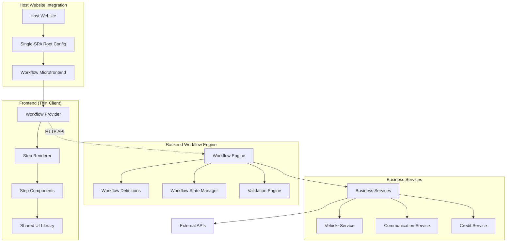

# T-Rex Microfrontend Presentation

## Session Overview: T-Rex Microfrontend Implementation Plan

**Presenter:** Lunga  
**Date:** October 13, 2025  
**Duration:** 45-60 minutes  
**Audience:** Development Team

---

## 🎯 Presentation Objectives

1. **Explain** what the T-Rex microfrontend application does
2. **Clarify** why this architecture approach was chosen
3. **Demonstrate** the user experience context and flow
4. **Outline** what the application aims to achieve
5. **Discuss** the implementation plan and next steps

---

## 📋 Agenda

1. **Introduction & Overview** (5 minutes)
2. **What is T-Rex?** (10 minutes)
3. **Technical Architecture Deep Dive** (15 minutes)
4. **User Experience Journey** (10 minutes)
5. **Business Value & Benefits** (5 minutes)
6. **Implementation Plan & Next Steps** (10 minutes)
7. **Q&A** (5-10 minutes)

---

## 1. Introduction & Overview

### Session Context
> "In this session Lunga will take us through the TRex micro-frontend and we will discuss the implementation plan."

### Current Status
- ✅ **Phase 1 Complete**: Core infrastructure implemented
- 🔄 **Phase 2 In Progress**: Advanced workflows being developed
- 📋 **Ready for**: Implementation planning discussion

### Key Deliverables
- Backend-driven workflow orchestration engine
- React microfrontend with Material UI
- Single-SPA integration framework
- Comprehensive vehicle buying/selling workflows

---

## 2. What is T-Rex?

### Core Purpose
**T-Rex is a microfrontend-based vehicle marketplace application that enables seamless vehicle buying and selling workflows through any host website.**

### Primary Functions

#### 🚗 **Vehicle Buying Workflow**
- **Intent Selection**: Users choose buying vs selling
- **Vehicle Discovery**: Advanced search with filters (make, model, price, location, etc.)
- **Vehicle Selection**: Browse and compare vehicles from multiple sources
- **Lead Generation**: Capture buyer information and preferences
- **Confirmation**: Finalize purchase intent and dealer matching

#### 🏷️ **Vehicle Selling Workflow**
- **Buyer Assessment**: Determine if seller has a buyer or needs dealer network
- **Buyer Type Classification**: Private buyer vs dealer transaction
- **Financing Evaluation**: Credit check and financing assistance
- **Replacement Planning**: Help sellers find replacement vehicles
- **Dealer Integration**: Connect with dealer network for best offers

### Technical Implementation
- **Frontend**: React microfrontend with Material UI components
- **Backend**: Spring Boot workflow orchestration engine
- **Architecture**: Backend-driven workflow with thin client frontend
- **Integration**: Single-SPA for seamless host website embedding

---

## 3. Technical Architecture Deep Dive

### 🏗️ System Architecture



### 🔧 Backend-Driven Workflow Orchestration

#### Why Backend-Driven?
1. **Security**: All business logic centralized and protected
2. **Maintainability**: Single source of truth for workflow logic
3. **Consistency**: Uniform behavior across all frontend instances
4. **Scalability**: Backend scales independently from frontend
5. **Integration**: Easy to integrate with external services

#### Workflow Engine Components

**Workflow Definitions** (`BuyingWorkflowDefinition.java`)
```java
// Centralized workflow logic
- Intent Selection → Vehicle Search → Results → Confirmation
- State management and transitions
- Validation rules and business logic
- Navigation history and back functionality
```

**State Management**
- Session-based workflow state persistence
- PostgreSQL for reliable state storage
- Redis caching for performance
- Event-driven state transitions

**API Contracts**
```typescript
// Clean separation between frontend and backend
POST /api/workflow/start     // Initialize session
POST /api/workflow/transition // Process step transitions
POST /api/workflow/back      // Navigate backwards
```

### 🎨 Frontend Architecture

#### Microfrontend Benefits
- **Independent Deployment**: Frontend and backend deploy separately
- **Technology Agnostic**: Host website can use any technology stack
- **Progressive Loading**: Components load on-demand
- **Shared Libraries**: Reusable UI components across workflows

#### Component Structure
```
microfrontends/buying-flow/
├── src/components/
│   ├── StepRenderer.tsx      // Dynamic step rendering
│   ├── VehicleCard.tsx       // Vehicle display components
│   └── ErrorBoundary.tsx     // Error handling
├── src/steps/
│   ├── IntentSelection.tsx   // Entry point
│   ├── VehicleSearch.tsx     // Advanced search
│   ├── VehicleDetails.tsx    // Vehicle information
│   ├── PersonalInfo.tsx      // Lead capture
│   └── Confirmation.tsx      // Final confirmation
└── src/types/
    └── global.d.ts           // TypeScript definitions
```

---

## 4. User Experience Journey

### 🎯 User Journey Mapping

#### Buying Experience Flow
```
1. Intent Selection
   └── "What would you like to do today?"
       ├── Buying a Vehicle → Vehicle Search
       └── Selling a Vehicle → Selling Flow

2. Vehicle Discovery
   ├── Advanced Search Filters
   │   ├── Make/Model Selection
   │   ├── Price Range (R100K - R2M)
   │   ├── Year Range (2015-2025)
   │   ├── Mileage Limits (≤200K km)
   │   ├── Body Type & Fuel Type
   │   └── Geographic Location
   │
   ├── Dynamic Model Loading
   └── Real-time Filter Updates

3. Vehicle Selection
   ├── Comprehensive Vehicle Data
   ├── Multiple Image Galleries
   ├── Specification Comparison
   └── Dealer Information

4. Lead Generation
   ├── Personal Information Capture
   ├── Contact Preferences
   ├── Financing Requirements
   └── Dealer Matching Preferences

5. Confirmation & Next Steps
   ├── Purchase Intent Confirmation
   ├── Dealer Assignment
   └── Communication Preferences
```

#### Selling Experience Flow
```
1. Initial Assessment
   ├── "Do you have a buyer?"
   │   ├── Yes → Buyer Type Selection
   │   └── No → Dealer Network Integration
   │
2. Buyer Classification
   ├── Private Buyer Path
   │   ├── Buyer Information
   │   ├── Financing Requirements
   │   └── Credit Assessment
   │
   └── Dealer Buyer Path
       ├── Dealer Information
       ├── Replacement Vehicle Needs
       └── Network Integration

3. Vehicle Replacement (Optional)
   ├── Same search experience as buying
   ├── Cross-workflow state sharing
   └── Seamless transition between flows
```

### 🎨 UI/UX Design Principles

#### User-Centered Design
- **Progressive Disclosure**: Information revealed step-by-step
- **Clear Visual Hierarchy**: Important information prominently displayed
- **Consistent Interaction Patterns**: Familiar UI patterns throughout
- **Responsive Design**: Works seamlessly on all device sizes
- **Accessibility**: WCAG 2.1 AA compliance

#### Visual Design System
- **Material UI**: Consistent component library
- **Custom Theming**: Brand-aligned color schemes and typography
- **Shared Component Library**: Consistent UI across all workflows
- **Loading States**: Clear feedback during async operations
- **Error Handling**: User-friendly error messages and recovery options

---

## 5. Business Value & Benefits

### 🎯 Strategic Advantages

#### For Vehicle Dealerships
- **Lead Generation**: High-quality, pre-qualified leads
- **Market Expansion**: Reach customers beyond traditional channels
- **Operational Efficiency**: Automated lead qualification and routing
- **Customer Experience**: Modern, seamless buying/selling process

#### For Host Websites
- **Revenue Opportunities**: Commission on successful transactions
- **User Engagement**: Increased time on site and user satisfaction
- **Competitive Advantage**: Differentiated user experience
- **Technical Flexibility**: Easy integration with existing infrastructure

### 💰 Cost-Effectiveness Benefits

#### Development Cost Savings
- **Shared Infrastructure**: Single backend serves multiple frontends
- **Reusable Components**: Shared UI library reduces development time
- **Monorepo Efficiency**: pnpm workspaces for optimal dependency management
- **Docker Optimization**: Efficient containerization and deployment

#### Operational Cost Benefits
- **Independent Scaling**: Frontend and backend scale separately
- **Circuit Breakers**: Protection against external service failures
- **Event-Driven Architecture**: Asynchronous processing reduces resource usage
- **Caching Strategy**: Redis caching for improved performance

### 📈 Scalability & Performance

#### Technical Scalability
- **Microservices Ready**: Backend can be split as needed
- **Horizontal Scaling**: Stateless design enables easy scaling
- **CDN Integration**: Static assets served globally
- **Database Optimization**: Efficient queries and indexing

#### Performance Optimization
- **Code Splitting**: Components loaded on-demand
- **Lazy Loading**: Images and heavy content loaded progressively
- **Caching Strategy**: Multi-level caching (Redis, browser, CDN)
- **Bundle Optimization**: Tree-shaking and dead code elimination

---

## 6. Implementation Plan & Next Steps

### 📅 Development Roadmap

#### Phase 1: Core Infrastructure ✅ **COMPLETED**
- [x] Monorepo setup with pnpm workspaces
- [x] Spring Boot workflow engine implementation
- [x] React microfrontend with Material UI
- [x] Single-SPA root configuration
- [x] PostgreSQL database schema
- [x] Docker containerization

#### Phase 2: Advanced Workflows 🔄 **IN PROGRESS**
- [x] Complete buying flow implementation
- [ ] Enhanced selling flow with dealer integration
- [ ] CarIn Analytics integration
- [ ] Credit check service integration
- [ ] Communication service setup
- [ ] Comprehensive testing suite

#### Phase 3: Business Integration 📋 **NEXT**
- [ ] External API integrations (vehicle data, credit checks)
- [ ] Dealer network integration
- [ ] Lead scoring and routing algorithms
- [ ] Multi-channel communication setup
- [ ] Analytics and reporting dashboard

#### Phase 4: Production Readiness 🚀 **FUTURE**
- [ ] Security hardening and authentication
- [ ] Performance optimization and monitoring
- [ ] CI/CD pipeline implementation
- [ ] Production deployment strategy
- [ ] Documentation and training materials

### 🎯 Immediate Next Steps

#### This Sprint
1. **Complete Selling Flow**
   - Finish remaining selling workflow steps
   - Implement dealer network integration
   - Add replacement vehicle flow

2. **Testing & Quality Assurance**
   - Unit tests for all components
   - Integration tests for workflow engine
   - End-to-end testing for complete flows

3. **Performance Optimization**
   - Implement Redis caching
   - Optimize database queries
   - Add loading states and error boundaries

#### Next Sprint
1. **External Integrations**
   - Vehicle data API integration
   - Credit check service connection
   - Communication provider setup

2. **Production Preparation**
   - Security review and hardening
   - Monitoring and logging setup
   - Documentation completion

### 🤝 Team Responsibilities

#### Backend Team
- Workflow engine enhancements
- External service integrations
- Database optimization
- API security and performance

#### Frontend Team
- UI/UX improvements
- Component library expansion
- Performance optimization
- Cross-browser testing

#### DevOps Team
- CI/CD pipeline setup
- Container optimization
- Monitoring implementation
- Production deployment

---

## 7. Q&A

### Discussion Points

1. **Architecture Decisions**
   - Backend-driven vs frontend-driven workflows
   - Microfrontend vs monolithic approach
   - Single-SPA integration strategy

2. **Technical Challenges**
   - State management across microfrontends
   - External API integration complexity
   - Performance optimization strategies

3. **Business Integration**
   - Dealer network partnerships
   - Lead management processes
   - Revenue model implementation

4. **Future Enhancements**
   - Mobile application development
   - Advanced analytics integration
   - Multi-language support

### Contact & Resources

- **Documentation**: [Comprehensive Development Guide](./Comprehensive%20Development%20Guide%20for%20a%20Cost-Effective%20Microfrontend%20Application%20(Revised).md)
- **Architecture**: [Workflow Architecture](./T-Rex_Microfrontend_Workflow_Architecture.md)
- **Troubleshooting**: [Troubleshooting Guide](./TROUBLESHOOTING.md)

---

## 📝 Key Takeaways

1. **T-Rex is a backend-driven microfrontend** that enables vehicle buying/selling through any host website
2. **Security and maintainability** are prioritized through centralized workflow orchestration
3. **User experience is seamless** with progressive disclosure and consistent design patterns
4. **Business value comes from** high-quality lead generation and operational efficiency
5. **Implementation follows a phased approach** with clear milestones and responsibilities

**Thank you for your attention!**

*Questions? Let's discuss the implementation plan and next steps.*