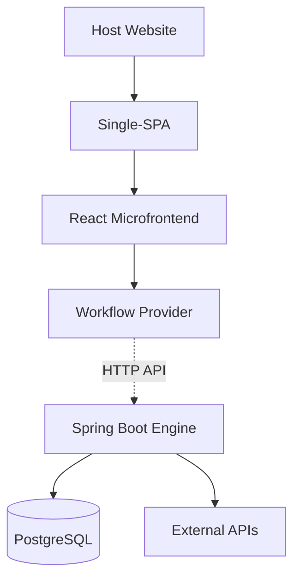

# T-Rex Microfrontend Presentation

## Session Overview: T-Rex Microfrontend Implementation Plan

**Presenter:** Lunga
**Date:** October 13, 2025
**Duration:** 30 minutes
**Audience:** Development Team

---

## 🎯 Presentation Objectives

1. **Explain** what T-Rex does and why we built it this way
2. **Show** the user experience and technical approach
3. **Highlight** business value and next steps

---

## 📋 Agenda (30 minutes)

1. **Introduction & What is T-Rex?** (8 minutes)
2. **Architecture & User Experience** (10 minutes)
3. **Business Value & Implementation** (7 minutes)
4. **Q&A** (5 minutes)

---

## 1. Introduction & What is T-Rex? (8 minutes)

### Session Context
> "In this session Lunga will take us through the TRex micro-frontend and we will discuss the implementation plan."

### Current Status
- ✅ **Phase 1 Complete**: Core infrastructure implemented
- 🔄 **Phase 2 In Progress**: Advanced workflows being developed
- 📋 **Ready for**: Implementation planning discussion

### What is T-Rex?
**T-Rex is a microfrontend-based vehicle marketplace application that enables seamless vehicle buying and selling workflows through any host website.**

### Core Workflows

#### 🚗 **Vehicle Buying**
Intent → Search → Results → Selection → Lead Capture → Confirmation

#### 🏷️ **Vehicle Selling**
Intent → Buyer Check → Dealer/Private Path → Financing → Replacement → Complete

**Key Features:**
- **Backend-driven orchestration** for security and consistency
- **Single-SPA integration** for seamless host embedding
- **Responsive UI** with Material Design components
- **Multi-step workflows** with state management

## 2. Architecture & User Experience (10 minutes)

### 🏗️ System Architecture


### 🔧 Why Backend-Driven?
- **Security**: Business logic protected server-side
- **Maintainability**: Single source of truth
- **Consistency**: Uniform behavior across instances
- **Scalability**: Independent scaling

### 🎯 User Experience Flow

#### Buying Journey (5 steps)
```
Intent Selection → Vehicle Search → Results → Selection → Lead Form → Confirmation
```

#### Selling Journey (Smart branching)
```
Intent Selection → Has Buyer? → Dealer/Private Path → Financing Check → Replacement Option
```

**Key UX Features:**
- **Progressive disclosure**: Information revealed step-by-step
- **Responsive design**: Works on all devices
- **Consistent UI**: Material Design components
- **Smart workflows**: Context-aware step navigation

---

## 3. Business Value & Implementation (7 minutes)

### 🎯 Strategic Value

#### For Dealerships
- **Lead Generation**: Pre-qualified, high-quality leads
- **Market Reach**: Access customers beyond traditional channels
- **Operational Efficiency**: Automated qualification and routing

#### For Host Websites
- **Revenue**: Commission on transactions
- **User Engagement**: Increased satisfaction and retention
- **Competitive Advantage**: Modern, seamless experience

### 💰 Cost Benefits
- **Shared Infrastructure**: One backend, multiple frontends
- **Reusable Components**: Shared UI library
- **Fast Development**: pnpm workspaces and Docker
- **Easy Scaling**: Stateless, microservice-ready design

### 📅 Implementation Plan

#### Current: Phase 2 (60% Complete)
- ✅ Buying flow working
- 🔄 Selling flow in progress
- ⏳ Dealer integration next

#### Next 4 Weeks
1. **Complete selling workflow** (Frontend team)
2. **Add dealer network integration** (Backend team)
3. **Implement comprehensive testing** (All teams)
4. **Performance optimization** (DevOps team)

#### Production Timeline Options
- **Aggressive**: 6-8 weeks (high risk, fast delivery)
- **Moderate**: 10-12 weeks (balanced approach) ⭐ **Recommended**
- **Conservative**: 14-16 weeks (low risk, thorough testing)

### 🤝 Team Focus Areas

| Team | This Sprint | Next Sprint |
|------|-------------|-------------|
| **Backend** | Selling workflow logic | External API integration |
| **Frontend** | Complete UI components | Testing & optimization |
| **DevOps** | Monitoring setup | CI/CD pipeline |

---

## 4. Q&A (5 minutes)

### Key Decisions Needed

1. **Timeline**: Aggressive vs Moderate vs Conservative?
2. **Architecture**: Confirm backend-driven approach?
3. **Testing**: How comprehensive should testing be?
4. **Team Structure**: Need additional roles?

### Resources Available
- **Technical Docs**: Architecture and implementation guides
- **Codebase**: Fully functional buying flow demo
- **Support**: Cross-team collaboration framework

---

## 📝 Key Takeaways (30 seconds)

1. **T-Rex enables** vehicle buying/selling through any website
2. **Backend-driven** architecture ensures security and consistency
3. **User experience** is intuitive with smart workflow branching
4. **Business value** comes from lead generation and market expansion
5. **Implementation** ready in 10-12 weeks with moderate approach

**Thank you! Questions?**