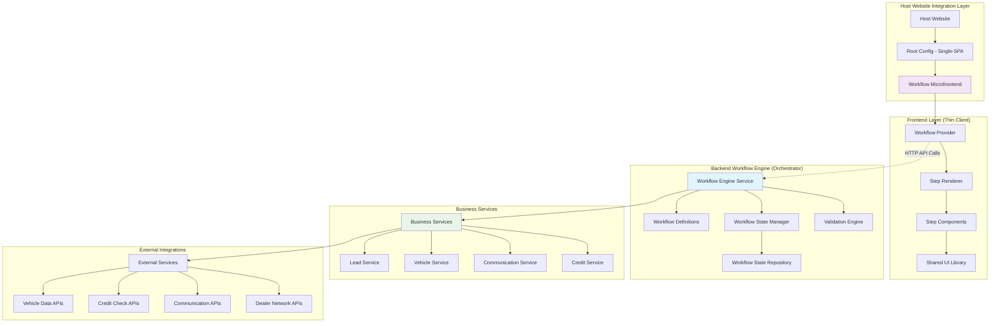
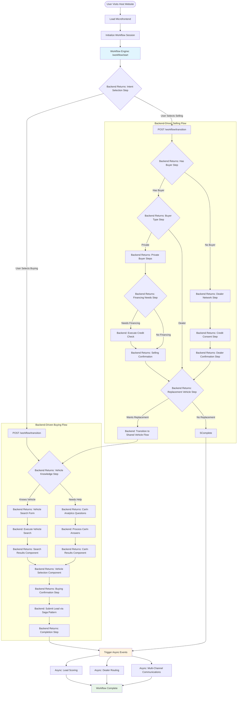
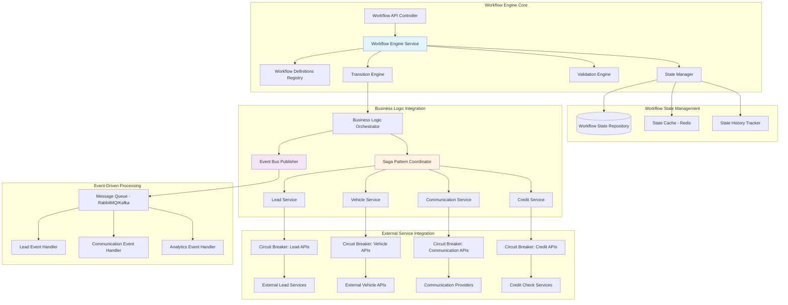
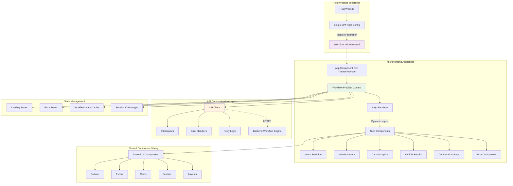
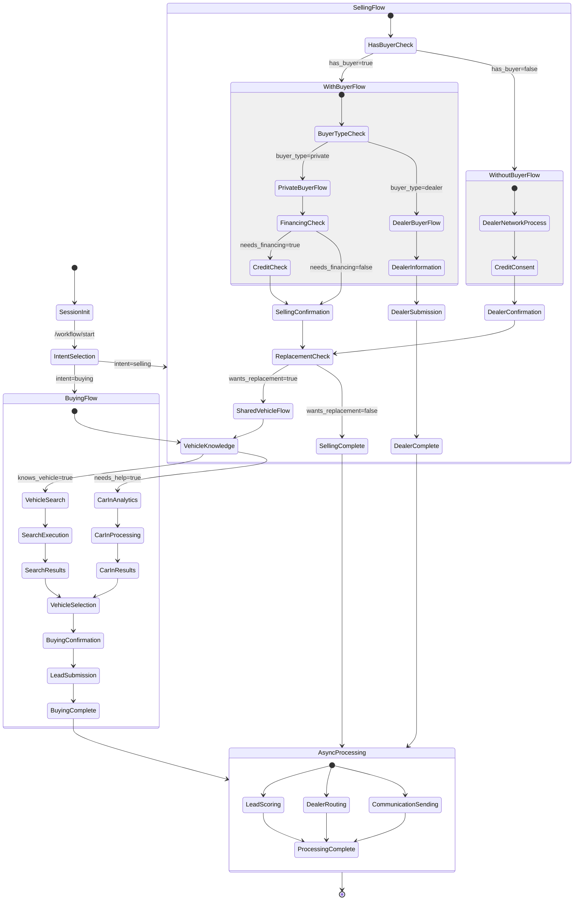

# T-Rex Microfrontend Workflow Architecture

## Comprehensive Workflow Architecture

This document outlines a unified architecture that combines the T-Rex Core Application Flow with microfrontend best practices, featuring backend-driven workflow orchestration for enhanced security, consistency, and maintainability.

## 1. High-Level System Architecture



## 2. Core Application Flow (Backend-Driven)



## 3. Backend Workflow Engine Architecture



## 4. Frontend Microfrontend Architecture



## 5. Detailed Workflow State Machine



## 6. API Contract Specifications

### 6.1 Workflow Engine API

```yaml
# OpenAPI 3.0 Specification
openapi: 3.0.0
info:
  title: T-Rex Workflow Engine API
  version: 1.0.0

paths:
  /api/workflow/start:
    post:
      summary: Initialize a new workflow session
      requestBody:
        required: true
        content:
          application/json:
            schema:
              type: object
              properties:
                sessionId:
                  type: string
                  format: uuid
                workflowType:
                  type: string
                  enum: [buying, selling]
                context:
                  type: object
      responses:
        200:
          description: Workflow started successfully
          content:
            application/json:
              schema:
                $ref: '#/components/schemas/WorkflowStepResponse'

  /api/workflow/transition:
    post:
      summary: Process a workflow transition
      requestBody:
        required: true
        content:
          application/json:
            schema:
              type: object
              properties:
                sessionId:
                  type: string
                  format: uuid
                currentStep:
                  type: string
                data:
                  type: object
      responses:
        200:
          description: Transition processed successfully
          content:
            application/json:
              schema:
                $ref: '#/components/schemas/WorkflowStepResponse'
        400:
          description: Validation error
          content:
            application/json:
              schema:
                $ref: '#/components/schemas/ValidationError'

  /api/workflow/back:
    post:
      summary: Navigate back in the workflow
      requestBody:
        required: true
        content:
          application/json:
            schema:
              type: object
              properties:
                sessionId:
                  type: string
                  format: uuid
                currentStep:
                  type: string
      responses:
        200:
          description: Back navigation successful
          content:
            application/json:
              schema:
                $ref: '#/components/schemas/WorkflowStepResponse'

components:
  schemas:
    WorkflowStepResponse:
      type: object
      properties:
        stepId:
          type: string
        componentName:
          type: string
        data:
          type: object
        validationRules:
          type: object
        navigationOptions:
          type: object
          properties:
            canGoBack:
              type: boolean
            nextStepId:
              type: string
        uiConfig:
          type: object
    
    ValidationError:
      type: object
      properties:
        field:
          type: string
        message:
          type: string
        code:
          type: string
```

## 7. Implementation Strategy

### 7.1 Phase 1: Core Infrastructure
- Set up monorepo structure with workspaces
- Implement Workflow Engine with basic state management
- Create shared UI component library
- Set up Single-SPA root configuration
- Implement basic buying flow (Intent → Vehicle Search → Results)

### 7.2 Phase 2: Advanced Workflows
- Complete selling flow implementation
- Add CarIn Analytics integration
- Implement shared vehicle discovery flow
- Add comprehensive validation engine
- Implement error handling and fallbacks

### 7.3 Phase 3: Business Logic & Integrations
- Implement Saga pattern for complex transactions
- Add circuit breakers for external services
- Implement event-driven architecture
- Add lead scoring and dealer routing
- Complete communication service integration

### 7.4 Phase 4: Production Readiness
- Add comprehensive monitoring and logging
- Implement automated testing suite
- Set up CI/CD pipelines
- Add security measures and authentication
- Performance optimization and caching

## 8. Key Benefits of This Architecture

### 8.1 Maintainability
- **Single Source of Truth**: All workflow logic centralized in backend
- **Consistent State Management**: Backend manages all state transitions
- **Easy Updates**: Workflow changes require only backend updates
- **Clear Separation**: Frontend focuses purely on presentation

### 8.2 Security
- **Server-Side Validation**: All business rules enforced on backend
- **Secure State**: Sensitive data never exposed to frontend
- **Controlled Flow**: Impossible to bypass workflow steps from frontend
- **API-First**: All interactions through secure, authenticated APIs

### 8.3 Scalability
- **Independent Scaling**: Frontend and backend scale independently
- **Microservice Ready**: Backend services can be split as needed
- **Event-Driven**: Asynchronous processing prevents bottlenecks
- **Circuit Breakers**: Resilient to external service failures

### 8.4 Integration Flexibility
- **Host Agnostic**: Works in any website with minimal integration
- **API Contracts**: Clear, versioned interfaces between components
- **Module Federation**: Dynamic loading of microfrontend components
- **Progressive Enhancement**: Graceful degradation for older browsers

This architecture provides a robust, scalable, and maintainable foundation for the T-Rex microfrontend application while adhering to modern best practices and ensuring seamless integration into third-party websites.