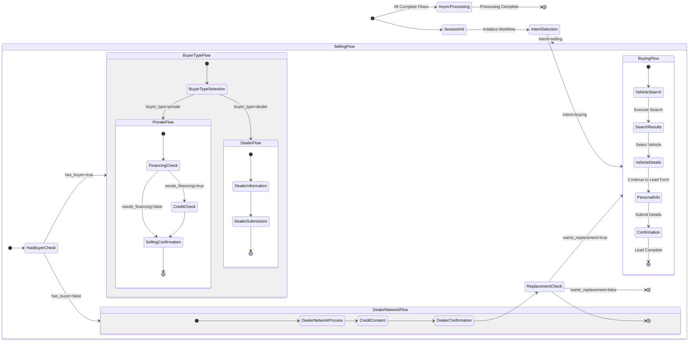
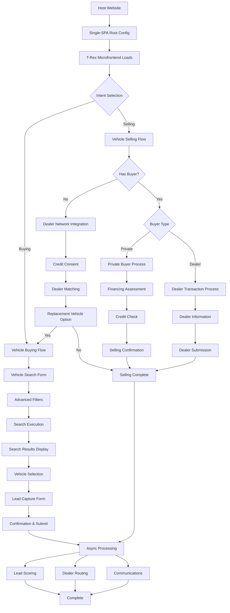
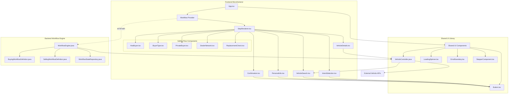
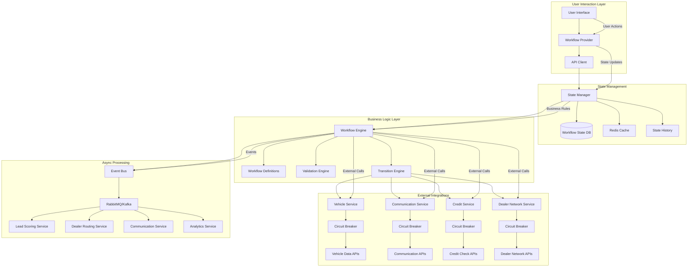

# T-Rex User Journey Visual Guide

## Complete User Experience Flow


## Workflow State Machine Diagram



## User Interface Flow



## Component Architecture



## Data Flow Architecture



## Technology Stack Overview

### Frontend Stack
- **React 18**: Component-based UI library
- **TypeScript**: Type-safe JavaScript
- **Material UI**: Component library with design system
- **Single-SPA**: Microfrontend framework
- **Webpack 5**: Module bundling and optimization
- **React Query**: Server state management and caching

### Backend Stack
- **Spring Boot 3**: Java web framework
- **PostgreSQL**: Relational database for state management
- **Redis**: Caching and session storage
- **Maven**: Dependency management
- **Docker**: Containerization
- **RabbitMQ**: Message queue for async processing

### Development Tools
- **pnpm**: Fast, disk-efficient package manager
- **ESLint/Prettier**: Code quality and formatting
- **Jest**: Testing framework
- **Maven Surefire**: Backend testing
- **Docker Compose**: Local development environment

## Key Integration Points

### Host Website Integration
```javascript
// Simple integration script
<script src="https://cdn.t-rex.com/t-rex-root-config.js"></script>
<div id="t-rex-container"></div>
```

### API Integration
```typescript
// Clean HTTP API contracts
interface WorkflowApi {
  startSession(): Promise<SessionId>
  getStep(stepId: string): Promise<StepConfig>
  submitTransition(data: FormData): Promise<NextStep>
  goBack(): Promise<PreviousStep>
}
```

### External Service Integration
- **Vehicle Data APIs**: Comprehensive vehicle information
- **Credit Check Services**: Financial assessment
- **Communication APIs**: Multi-channel messaging
- **Dealer Network APIs**: Dealership connectivity

## Benefits Visualization

### Scalability Benefits
- **Horizontal Scaling**: Stateless design enables easy scaling
- **Independent Deployment**: Frontend and backend deploy separately
- **Microservice Ready**: Backend can be split as needed
- **CDN Integration**: Global content delivery

### Security Benefits
- **Backend Validation**: All business rules server-side
- **State Protection**: Sensitive data never in frontend
- **CORS Configuration**: Secure cross-origin requests
- **Input Sanitization**: Protection against XSS attacks

### Performance Benefits
- **Code Splitting**: Components loaded on-demand
- **Caching Strategy**: Multi-level caching implementation
- **Lazy Loading**: Progressive content loading
- **Bundle Optimization**: Minimal JavaScript footprint